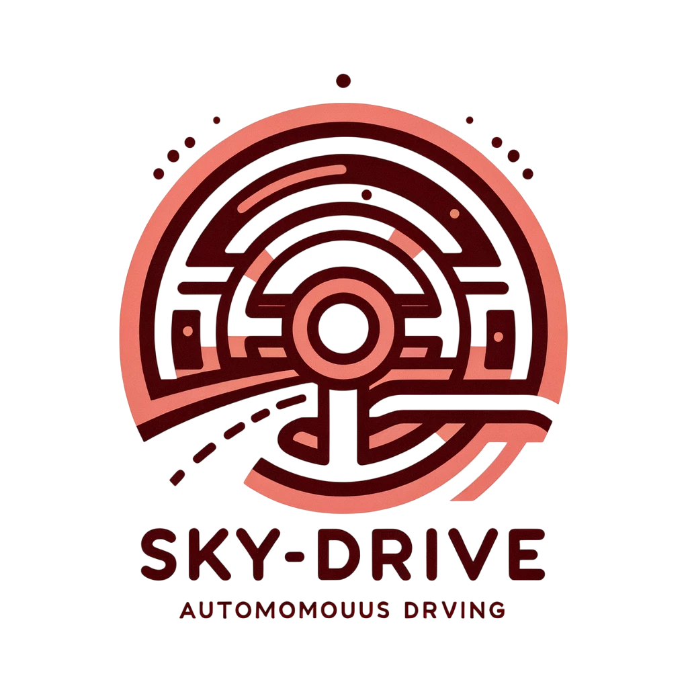

Hello there!

I am a first-year **Ph.D. student** in the Department of Civil and Environmental Engineering at the [University of Wisconsin-Madison](https://www.wisc.edu/) (UW-Madison). I joined [Sky-Lab](https://sky-lab-uw.github.io/) at UW-Madison in Fall 2025 under the guidance of Dr.[Sikai (Sky) Chen](https://sky-lab-uw.github.io/people/). On Wisconsin!

An equally important dimension of my work is to validate autonomous driving related methods through real‑vehicle testing: I have contributed to the development of [SkyDrive](https://github.com/BillWan-zzzyyy/Sky-Drive), an open source multi-agent platform for future transportation system and autonomous driving by Sky-Lab.